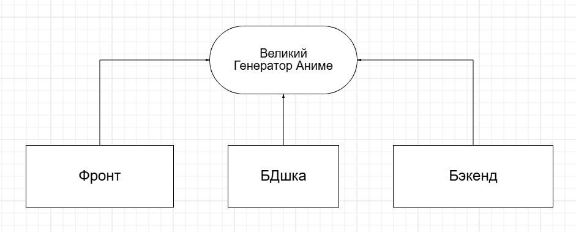

# Вопросы и ответы

### 1) Зачем нужна Java?
Java — **кроссплатформенный** объектно-ориентированный язык со строгой статической типизацией.
Применяется в:
*   **Backend-разработке** высоконагруженных корпоративных приложений.
*   **Биг дата** (экосистема Apache) и др.
*   Имеет большое количество развитых фреймворков.

### 2) Зачем нужен Docker?
Docker — платформа для **контейнеризации**, которая:
*   Решает проблему изоляции зависимостей.
*   Позволяет унифицировать среду разработки.
*   Дает возможность добиться лучшей масштабируемости продукта.

### 3) Почему я решил стать программистом?
*   **Интеллектуальный вызов.** Всегда любил решать задачки.
*   **Высокая автономия карьеры.** Рынок труда позволяет строить карьеру на основе конкретных компетенций, не полагаясь на удачу или связи.
*   Работа часто **remote-friendly**.

### 4) Почему я не люблю Windows?
*   Навязчивые обновления
*   Высокое потребление ресурсов
*   Пользователь не контролирует систему в полной мере

### 5) Хобби любимого преподавателя
*   Смотреть аниме
*   Учить ML
*   Судя по условию этой лабы, иногда зависать на МСС
*   To be a chill guy
 
### 6) Великая блок-схема, демонстрирующая выдающийся ход мысли

### 7) Что в итоге?
*   Сборка через **docker-compose up --build** из корня проекта
*   Доступ на главную страницу через http://localhost:3000/
*   Отключение через **docker-compose down -v**
*   В некоторых браузерах (Chrome) странно отображается цвет фона, так что вот картинки с задуманным дизайном

